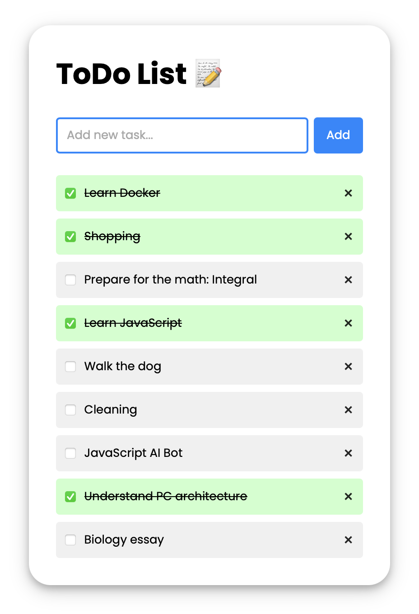

[](https://developer.mozilla.org/en-US/docs/Web/JavaScript)
[](https://developer.mozilla.org/en-US/docs/Web/HTML)
[](https://developer.mozilla.org/en-US/docs/Web/CSS)
[](https://nodejs.org/)
[](https://www.mongodb.com/)
[](https://www.docker.com/)

# ToDo List Web Application

This is a user-friendly To-Do List web application built using HTML, CSS, JavaScript, Node.js and MongoDB. It enables users to create and delete tasks, mark them as completed, and store their progress in a database. The app provides a simple and efficient way to manage daily tasks and stay organized.

## ToDo List Design



## Components

The application consists of the following components:

- **Client:** A front-end built with HTML, CSS, and JavaScript that provides an interactive UI for users to manage their tasks.
- **Server:** A Node.js-based back-end that handles API requests and communicates with the database.
- **Database (MongoDB):** A NoSQL database that stores user tasks and their statuses.
- **Docker:** A containerized environment that facilitates easy deployment and management of the application.

## Setup and Running

**1. Preparing the Environment**:  
Before running the application, you need to build the Docker images and set up the necessary resources:  
```bash
./prepare-app.sh
```

**2. Starting the Application**:  
To launch all services (client, server, and database), run:  
```bash
./start-app.sh
```
Once started, the application will be available in your browser: **http://localhost**

**3. Stopping the Application**:  
To stop all running containers, use:  
```bash
./end-app.sh
```

> [!IMPORTANT]
>
> Make sure the scripts have execution permissions before running them:  
> ```bash
> chmod +x prepare-app.sh start-app.sh end-app.sh
> ```

## Author

Created by [Denys Bondarchuk](https://github.com/profjuvii). If you have any questions or suggestions, feel free to contact me.
